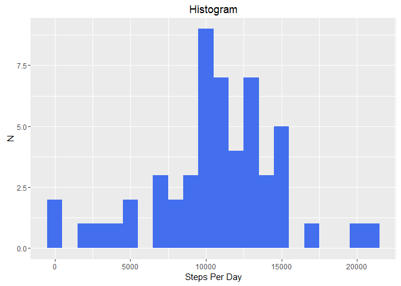
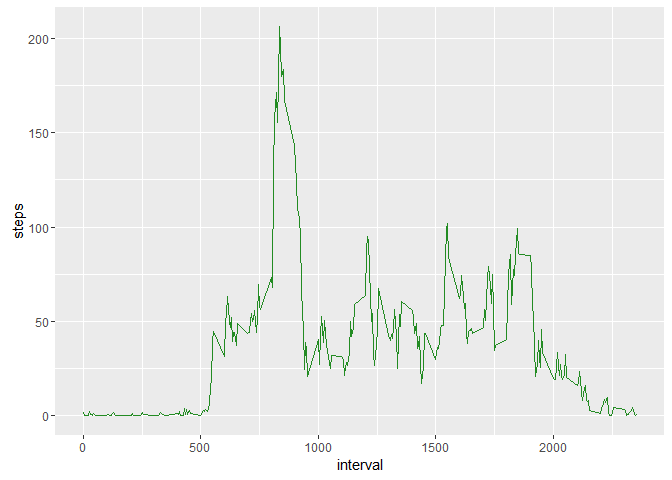
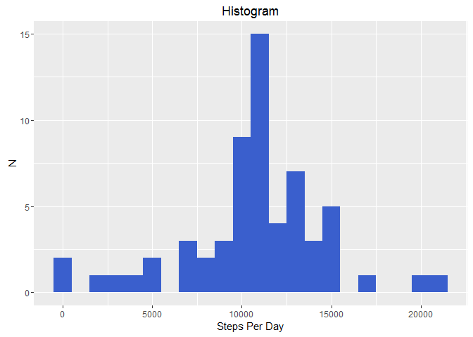

# Reproducible Research: Peer Assessment 1


## Loading and preprocessing the data


```r
library(dplyr)
```

```
## 
## Attaching package: 'dplyr'
```

```
## The following objects are masked from 'package:stats':
## 
##     filter, lag
```

```
## The following objects are masked from 'package:base':
## 
##     intersect, setdiff, setequal, union
```

```r
library(lubridate)
```

```
## 
## Attaching package: 'lubridate'
```

```
## The following object is masked from 'package:base':
## 
##     date
```

```r
activity  <- read.csv("activity.csv", header=TRUE, 
                      colClasses=c("numeric", "character", "integer"))
activity$date  <- ymd(activity$date)
```

## What is mean total number of steps taken per day?


```r
library(ggplot2)

steps <- activity %>%
    filter(!is.na(steps)) %>%
    group_by(date) %>%
    summarize(steps = sum(steps)) %>%
    print()
```

```
## # A tibble: 53 x 2
##          date steps
##        <date> <dbl>
## 1  2012-10-02   126
## 2  2012-10-03 11352
## 3  2012-10-04 12116
## 4  2012-10-05 13294
## 5  2012-10-06 15420
## 6  2012-10-07 11015
## 7  2012-10-09 12811
## 8  2012-10-10  9900
## 9  2012-10-11 10304
## 10 2012-10-12 17382
## # ... with 43 more rows
```

```r
ggplot(steps, aes(x=steps)) + geom_histogram(fill="royalblue2", binwidth=1000) +
    labs(title="Histogram", x="Steps Per Day", y="N") 
```

<!-- -->

```r
steps_mean <- mean(steps$steps, na.rm = TRUE)
steps_med <- median(steps$steps, na.rm = TRUE)

print(c("Mean Steps:", steps_mean))
```

```
## [1] "Mean Steps:"      "10766.1886792453"
```

```r
print(c("Median Steps:", steps_med))
```

```
## [1] "Median Steps:" "10765"
```


## What is the average daily activity pattern?


```r
meanStepsPerInterval <- activity %>%
    filter(!is.na(steps)) %>%
    group_by(interval) %>%
    summarize(steps=mean(steps))

ggplot(meanStepsPerInterval, aes(x=interval, y=steps)) + geom_line(color="forestgreen")
```

<!-- -->

```r
meanStepsPerInterval[which.max(meanStepsPerInterval$steps),]
```

```
## # A tibble: 1 x 2
##   interval    steps
##      <int>    <dbl>
## 1      835 206.1698
```


## Imputing missing values


```r
activityNA <- activity 

#impute NA values with mean steps for that interval
for(i in 1:nrow(activityNA)){
    if(is.na(activityNA[i,"steps"])){
        activityNA[i,"steps"] <-
            meanStepsPerInterval[meanStepsPerInterval$interval==activityNA$interval[i],"steps"]
    }
}

stepsNA <- activityNA %>%
    filter(!is.na(steps)) %>%
    group_by(date) %>%
    summarize(steps = sum(steps)) %>%
    print()
```

```
## # A tibble: 61 x 2
##          date    steps
##        <date>    <dbl>
## 1  2012-10-01 10766.19
## 2  2012-10-02   126.00
## 3  2012-10-03 11352.00
## 4  2012-10-04 12116.00
## 5  2012-10-05 13294.00
## 6  2012-10-06 15420.00
## 7  2012-10-07 11015.00
## 8  2012-10-08 10766.19
## 9  2012-10-09 12811.00
## 10 2012-10-10  9900.00
## # ... with 51 more rows
```

```r
ggplot(stepsNA, aes(x=steps)) + geom_histogram(fill="royalblue3", binwidth=1000) +
    labs(title="Histogram", x="Steps Per Day", y="N") 
```

<!-- -->

```r
steps_meanNA <- mean(stepsNA$steps, na.rm = TRUE)
steps_medNA <- median(stepsNA$steps, na.rm = TRUE)

print(c("Mean Steps:", steps_meanNA))
```

```
## [1] "Mean Steps:"      "10766.1886792453"
```

```r
print(c("Median Steps:", steps_medNA))
```

```
## [1] "Median Steps:"    "10766.1886792453"
```

```r
print(c("Difference in Mean Steps With Impute:", steps_meanNA - steps_mean))
```

```
## [1] "Difference in Mean Steps With Impute:"
## [2] "0"
```

```r
print(c("Difference in Median Steps With Impute:", steps_medNA - steps_med))
```

```
## [1] "Difference in Median Steps With Impute:"
## [2] "1.1886792452824"
```


## Are there differences in activity patterns between weekdays and weekends?


```r
activityNA$date  <- as.Date(activityNA$date) #convert to date form char

activityNA <- mutate(activityNA, weektype=ifelse(weekdays(activityNA$date) == "Saturday" 
                                                 | weekdays(activityNA$date) == "Sunday", 
                                                 "weekend", "weekday"))

activityNA$weektype <- as.factor(activityNA$weektype)

meanStepsPerIntervalNA <- activityNA %>%
  group_by(interval, weektype) %>%
  summarise(steps = mean(steps))

ggplot(meanStepsPerIntervalNA, aes(x=interval, y=steps, color=weektype)) + 
    geom_line() +
    facet_wrap(~weektype, ncol=1, nrow=2)
```

<!-- -->


